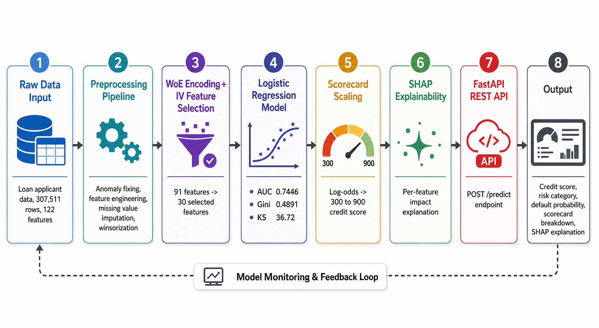
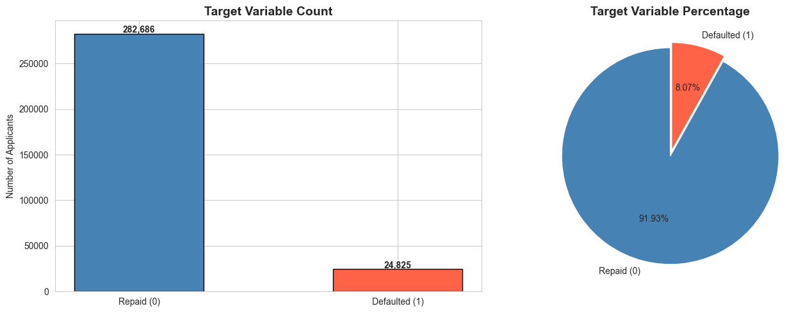
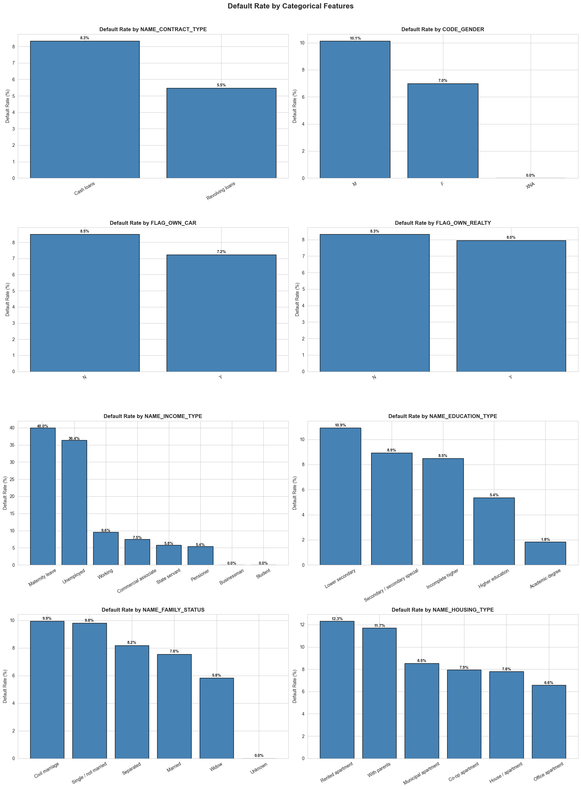
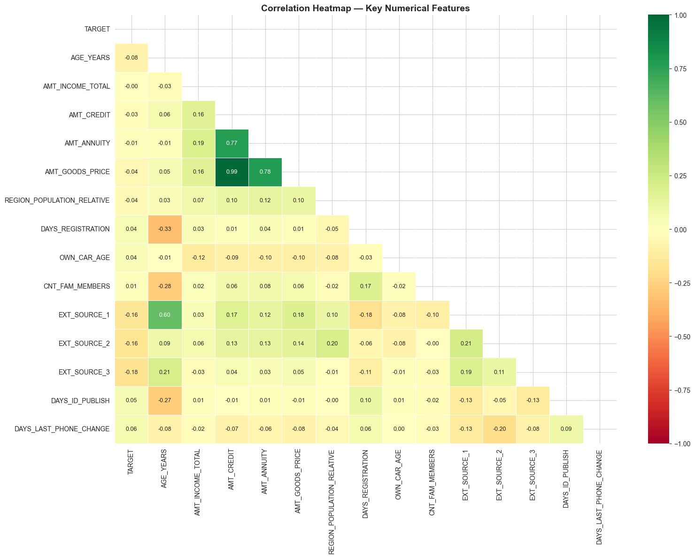
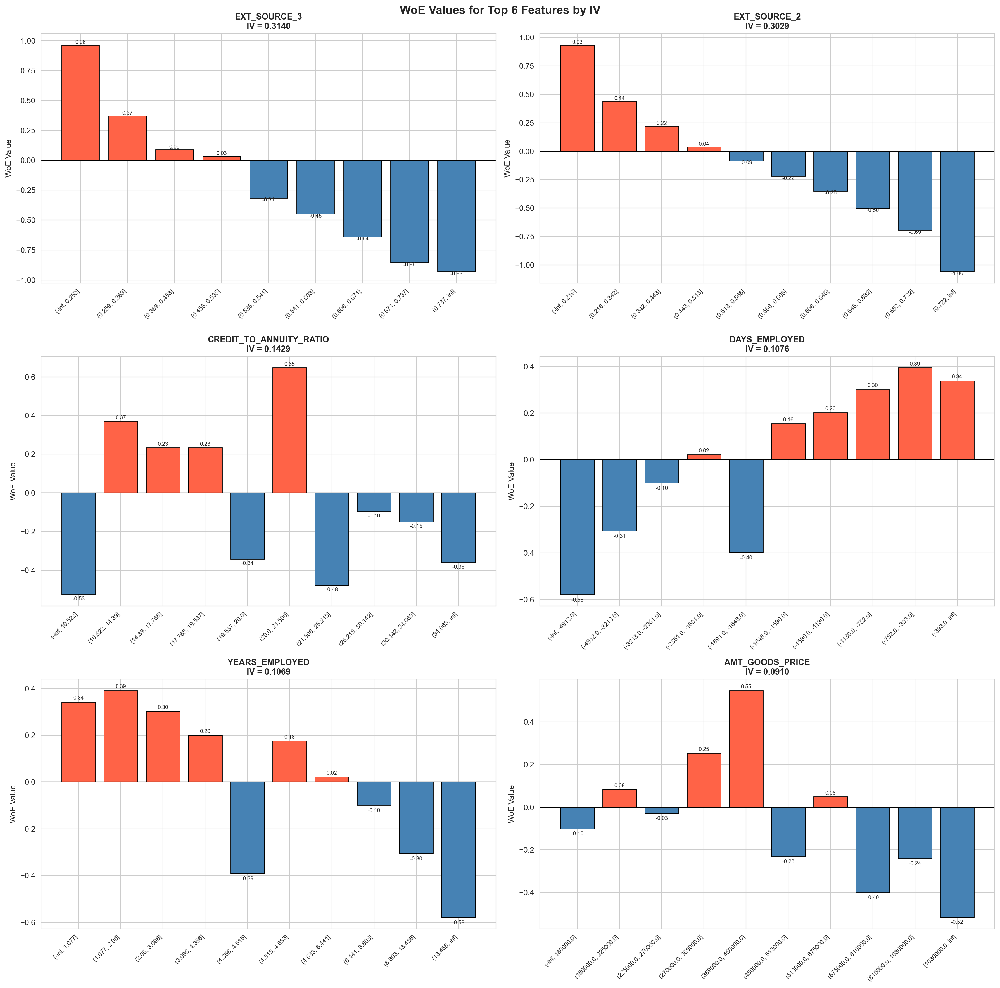
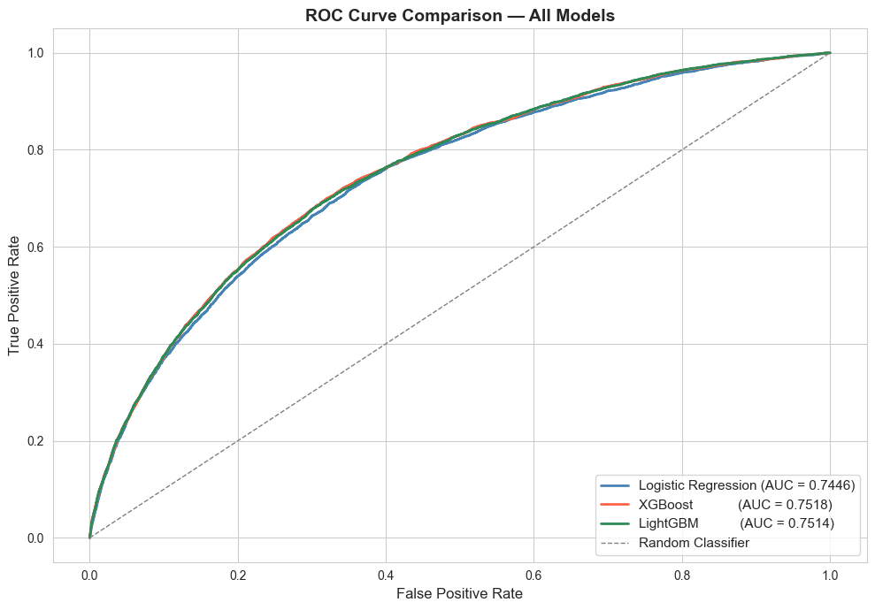
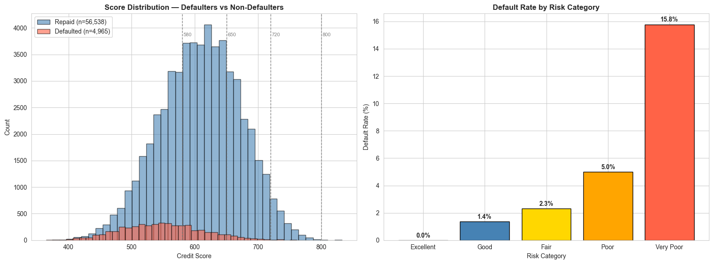
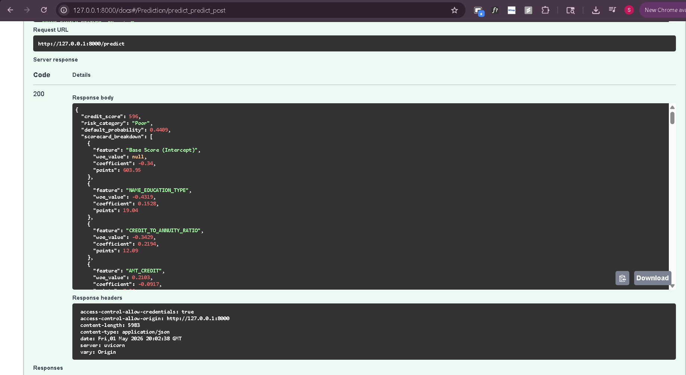

# 🏦 Credit Scoring Engine


> A production-grade credit scoring system inspired by bank-style scorecard methodology. Takes raw loan applicant data and returns a **credit score (300–900)**, risk category, default probability, per-feature scorecard breakdown, and SHAP explanations.

---

## 💡 Why This Matters

Banks approve or reject thousands of loan applications daily. A credit score is the single number that drives that decision. This project builds the full pipeline behind that number:

- **Who uses it** — loan officers, credit risk teams, automated decisioning systems
- **What decision it supports** — loan approval, interest rate pricing, manual review flagging
- **Why explainability matters** — regulators require banks to explain every rejection. Black-box models like XGBoost cannot be submitted for regulatory approval. This scorecard can.

---

## ⚠️ Project Scope

This is a portfolio project built on the **Home Credit Default Risk** Kaggle dataset. It is not trained on a real bank's proprietary portfolio. The methodology is inspired by industry-standard credit scorecard practices. Score ranges and thresholds are calibrated for demonstration purposes.

---

## 🏗️ System Architecture



---

## ✨ What Makes This Different

Most ML projects stop at a Jupyter notebook with an accuracy score. This one goes further:

- ✅ **Weight of Evidence (WoE)** encoding — standard for credit risk features
- ✅ **Information Value (IV)** feature selection — dropped 61 weak features, kept 30 strong ones
- ✅ **Logistic Regression Scorecard** scaled to 300–900 — explainable and auditable
- ✅ **SHAP explanations** — every prediction explained per feature
- ✅ **Bank-standard metrics** — Gini coefficient, KS statistic, PSI
- ✅ **FastAPI REST API** — callable by anyone, anywhere
- ✅ **Docker** — fully containerized

---

## 📊 Model Performance

| Metric | Train | Test |
|--------|-------|------|
| AUC | 0.7409 | 0.7446 |
| Gini Coefficient | 0.4818 | 0.4891 |
| KS Statistic | 36.18 | 36.72 |
| PSI | — | 0.0001 ✅ Stable |

> In credit risk modeling, a Gini above 0.4 and KS above 30 are commonly used benchmarks for acceptable scorecard performance.

---

## 🎯 Risk Categories & What They Mean

| Score | Category | Default Rate | Operational Meaning |
|-------|----------|--------------|---------------------|
| 800–900 | 🟢 Excellent | ~0.0% | Approve — best rates |
| 720–799 | 🔵 Good | ~1.4% | Approve — standard rates |
| 650–719 | 🟡 Fair | ~2.3% | Approve with monitoring |
| 580–649 | 🟠 Poor | ~5.0% | Higher rate or collateral |
| 300–579 | 🔴 Very Poor | ~15.8% | Decline or manual review |

**Example:** A score of 596 (Poor) means the applicant has a 44% estimated default probability. Operationally this would trigger a manual review or require collateral before approval.

---

## 📈 EDA Insights

### Target Distribution


> 91.9% repaid vs 8.1% defaulted — 11:1 class imbalance handled using class weights.

### Default Rate by Key Features


### Correlation Heatmap


---

## 🔬 WoE & IV Analysis

### Top Features by Information Value


> EXT_SOURCE_2 and EXT_SOURCE_3 (external credit bureau scores) are the strongest predictors with IV above 0.30.

---

## 📉 Model Evaluation

### ROC Curve — All Models Compared


> Logistic Regression chosen over XGBoost and LightGBM despite marginally lower AUC because it is fully explainable, required for scorecard scaling, and produces well-calibrated probabilities.

---

## 🎰 Scorecard Distribution



> Default rates increase monotonically across risk categories — confirming the scorecard discriminates correctly.

---

## ⚡ Quick Start

```bash
# 1. Clone the repo
git clone https://github.com/saicharan8855/credit-scoring-engine.git
cd credit-scoring-engine

# 2. Install dependencies
pip install -r requirements.txt

# 3. Start the API
uvicorn api.main:app --reload --port 8000
```

Open your browser at:
- **Swagger Docs** → http://127.0.0.1:8000/docs
- **Health Check** → http://127.0.0.1:8000/health

---

## 🚀 API Endpoints

| Method | Endpoint | Description |
|--------|----------|-------------|
| GET | `/health` | Check if API is running |
| POST | `/predict` | Get full credit assessment |
| POST | `/predict/explain` | Get assessment with plain English explanation |
| GET | `/docs` | Swagger UI documentation |

### Example Request

```bash
curl -X POST http://127.0.0.1:8000/predict \
  -H "Content-Type: application/json" \
  -d '{
    "AMT_CREDIT": 500000,
    "AMT_ANNUITY": 25000,
    "AMT_INCOME_TOTAL": 180000,
    "AMT_GOODS_PRICE": 450000,
    "CODE_GENDER": "M",
    "DAYS_BIRTH": -12000,
    "DAYS_EMPLOYED": -3000,
    "EXT_SOURCE_2": 0.6,
    "EXT_SOURCE_3": 0.5,
    "NAME_EDUCATION_TYPE": "Higher education",
    "NAME_INCOME_TYPE": "Working",
    "NAME_FAMILY_STATUS": "Married",
    "NAME_HOUSING_TYPE": "House / apartment",
    "NAME_CONTRACT_TYPE": "Cash loans",
    "FLAG_OWN_CAR": "Y",
    "FLAG_OWN_REALTY": "Y",
    "CNT_CHILDREN": 0,
    "CNT_FAM_MEMBERS": 2,
    "DAYS_REGISTRATION": -5000,
    "DAYS_ID_PUBLISH": -2000,
    "DAYS_LAST_PHONE_CHANGE": -500,
    "REGION_RATING_CLIENT": 2,
    "REGION_RATING_CLIENT_W_CITY": 2,
    "REGION_POPULATION_RELATIVE": 0.035,
    "OCCUPATION_TYPE": "Laborers",
    "ORGANIZATION_TYPE": "Business Entity Type 3",
    "TOTALAREA_MODE": 0.05,
    "FLOORSMAX_AVG": 0.1,
    "FLOORSMAX_MODE": 0.1,
    "FLOORSMAX_MEDI": 0.1,
    "YEARS_BEGINEXPLUATATION_AVG": 0.9,
    "YEARS_BEGINEXPLUATATION_MODE": 0.9,
    "YEARS_BEGINEXPLUATATION_MEDI": 0.9,
    "OWN_CAR_AGE": 5,
    "EXT_SOURCE_1": 0.5
  }'
```

### Example Response

```json
{
  "credit_score": 596,
  "risk_category": "Poor",
  "default_probability": 0.4409,
  "scorecard_breakdown": [
    {"feature": "Base Score (Intercept)", "points": 603.95},
    {"feature": "NAME_EDUCATION_TYPE", "points": 19.04},
    {"feature": "CREDIT_TO_ANNUITY_RATIO", "points": 12.09}
  ],
  "shap_explanation": [
    {"feature": "NAME_EDUCATION_TYPE", "shap_value": -0.2728, "impact": "decreases default risk"},
    {"feature": "AMT_GOODS_PRICE", "shap_value": 0.2681, "impact": "increases default risk"}
  ],
  "top_risk_factors": ["AMT_GOODS_PRICE", "CODE_GENDER", "EXT_SOURCE_3"],
  "top_strengths": ["NAME_EDUCATION_TYPE", "CREDIT_TO_ANNUITY_RATIO", "AMT_CREDIT"]
}
```

---

### Swagger UI



---

## 🧠 Challenges & Key Learnings

- **Class imbalance (11:1 ratio)** — Handled using `class_weight='balanced'` in Logistic Regression instead of synthetic oversampling. This avoids introducing artificial patterns into the training data.

- **WoE binning stability** — A single row sent to the API causes `pd.cut` to fail because min equals max. Solved by building a custom bin lookup using stored bin edges instead of re-running pd.cut on inference.

- **Why Logistic Regression over XGBoost** — XGBoost had marginally higher AUC (0.7518 vs 0.7446) but Logistic Regression was chosen because it is required for scorecard scaling, produces well-calibrated probabilities, and is explainable to regulators. The AUC difference of 0.007 does not justify the loss of explainability.

- **Score compression** — Initial scorecard produced scores only between 521 and 708. Fixed by calibrating anchor points (target_odds, PDO) to match the actual probability distribution of our model rather than using textbook defaults.

---

## 🐳 Docker

```bash
# Build the image
docker build -t credit-scoring-engine .

# Run the container
docker run -p 8000:8000 credit-scoring-engine
```

---

## 📁 Project Structure

```text
credit-scoring-engine/
├── data/
│   ├── raw/
│   ├── processed/
│   └── external/
├── notebooks/
│   ├── 01_eda.ipynb
│   ├── 02_woe_iv_analysis.ipynb
│   ├── 03_model_training.ipynb
│   ├── 04_scorecard.ipynb
│   └── 05_shap_explainability.ipynb
├── src/
│   ├── data/
│   │   ├── ingestion.py
│   │   └── preprocessing.py
│   ├── features/
│   │   ├── woe_encoder.py
│   │   └── iv_selector.py
│   ├── models/
│   │   ├── scorecard.py
│   │   ├── train.py
│   │   └── evaluate.py
│   └── explainability/
│       └── shap_explainer.py
├── api/
│   ├── main.py
│   ├── schemas.py
│   ├── predictor.py
│   └── explainer.py
├── models/
├── docs/
├── Dockerfile
├── requirements.txt
└── README.md
```

---

## 🛠️ Tech Stack

| Category | Tools |
|----------|-------|
| Data Processing | pandas, numpy |
| Machine Learning | scikit-learn, XGBoost, LightGBM |
| WoE / Scorecard | Custom implementation using pandas |
| Explainability | SHAP |
| Experiment Tracking | MLflow |
| API | FastAPI, Uvicorn, Pydantic |
| Containerization | Docker |
| Dataset | Home Credit Default Risk (Kaggle) |

---

## 📦 Dataset

**Home Credit Default Risk** — Kaggle Competition

- 307,511 loan applications
- 122 raw features
- 8.07% default rate
- Download: https://www.kaggle.com/competitions/home-credit-default-risk/data

---

## 📜 License

MIT License — see [LICENSE](LICENSE) for details.
